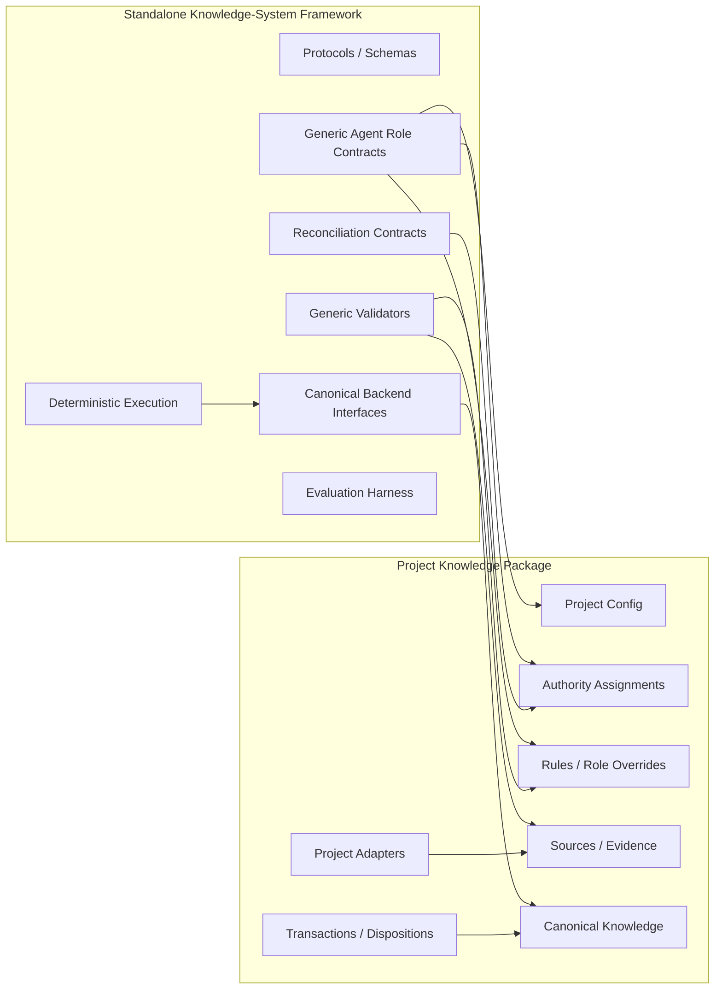
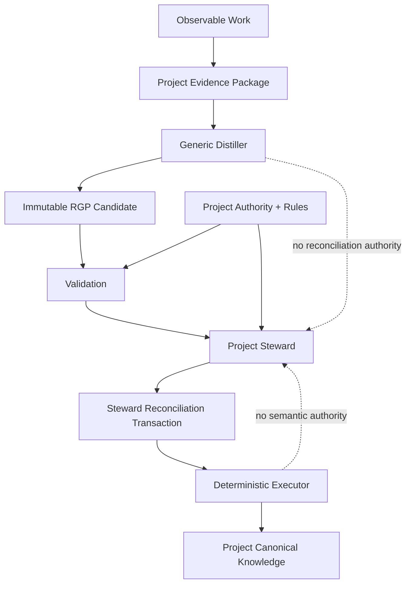

# Reasoning Distiller Extraction v2 — Final Architecture and Implementation Plan

Status: **STEWARD APPROVED — implementation plan**
Date: 2026-08-17
Authority: **Project Engineering Steward**
Supersedes: `docs/distiller/PROPOSAL_STANDALONE_REPOSITORY.md` and its prior extraction disposition for implementation purposes
Reviewed inputs:

- `docs/distiller/reviews/EXTRACTION_V2_RPG_ENGINEER_PROPOSAL.md`
- `docs/distiller/reviews/EXTRACTION_V2_ENGINEER_SYNTHESIS.md`

## 1. Decision

**Approve extraction before Phase 6.1 productization.**

Create a standalone repository for the reusable knowledge-system framework. Keep each project's active knowledge, evidence, policy, authority assignments, role configuration, and canonical data in a project-owned **Project Knowledge Package**.

The voxel-engine corpus becomes the first immutable reference/proving corpus. Active voxel-engine canonical memory does **not** become standalone framework state.

### Governing principle

> **Framework = reusable mechanisms and contracts. Project package = actual knowledge and project governance.**

## 2. Architecture at a glance



### Runtime authority flow



**Authority invariant:** Distiller proposes. Steward reconciles and authorizes. Executor proves/applies the exact authorized transaction.

## 3. Ownership boundary

| Asset / responsibility | Framework | Project package |
|---|:---:|:---:|
| RGP and generic evidence protocols | ✓ | |
| Generic schemas | ✓ | |
| Generic validators | ✓ | |
| Distiller role/directive | ✓ | |
| Steward role contract/default directive | ✓ | |
| Architect/Engineer role contracts/default directives | ✓ | |
| Reconciliation/admission transaction contracts | ✓ | |
| Lifecycle/orchestration contracts | ✓ | |
| Deterministic proof/execution engine | ✓ | |
| Canonical backend interfaces | ✓ | |
| Generic PEMS/2+COVE schemas/tooling | ✓ | |
| Evaluation harness/generic fixtures | ✓ | |
| Voxel-engine reference corpus copy | ✓, test-only | |
| Active project PEMS/COVE data | | ✓ |
| Project source/evidence registry | | ✓ |
| Project-specific rulesets | | ✓ |
| Project role directives/overrides | | ✓ |
| Actual role/authority assignments | | ✓ |
| Project admission/governance policy | | ✓ |
| Project transactions/dispositions | | ✓ |
| Domain adapters/extensions | | ✓ |

### Important distinction

A **role contract** can be generic; **authority is project-granted**. A **schema/validator** can be generic; **the data and project rules it validates are project-owned**. PEMS/2+COVE may be a first-party canonical backend without becoming mandatory RGP semantics.

## 4. Target layouts

### Standalone repository

```text
reasoning-distiller/
├── protocols/
├── schemas/
├── validators/
├── agents/
│   ├── distiller/
│   ├── steward/
│   ├── architect/
│   └── engineer/
├── reconciliation/
├── admission/
├── backends/
│   └── pems-cove/
├── orchestration/
├── evaluation/
│   ├── harness/
│   ├── fixtures/
│   └── corpus/voxel-engine/
├── tests/
└── docs/
```

### Project Knowledge Package

```text
project-knowledge/
├── project.yaml
├── authority/
├── rules/
├── roles/
├── sources/
├── evidence/
├── canonical/
├── transactions/
├── dispositions/
├── adapters/
└── policy/
```

`project.yaml` identifies the package and compatible framework/contracts. The package contract defines capabilities and locations, not domain vocabulary.

## 5. Dependency rules

1. Framework code may depend only on framework contracts and project data exposed through the Project Knowledge Package contract.
2. Project packages may depend on a versioned framework release.
3. Framework code must not import a consuming project's implementation or active canonical files.
4. Project policy must not be compiled into generic validators or default agent roles.
5. Generic roles do not grant themselves project authority.
6. RGP remains independent of a particular canonical backend.
7. PEMS/2+COVE is the first proven backend; it is not mandatory for every future consumer.

## 6. Extraction scope

### Extract as framework

- `rgp/1` protocol and validator;
- generic source/provenance semantics;
- generic evidence-envelope work as it is formalized;
- generic agent role contracts/directives;
- generic validation infrastructure;
- reconciliation/admission transaction contracts;
- deterministic exact-base proof/execution machinery;
- PEMS/2+COVE generic schemas, validators, deterministic format/install tooling under the backend boundary;
- evaluation/scoring harness;
- generic fixtures and failure-pressure tests;
- lifecycle/orchestration contracts and production documentation that are project-independent.

### Copy as reference corpus

Preserve fixed voxel-engine material needed to prove behavior:

- Phase 0 corpus/expected/scoring inputs;
- raw independent Phase 1 candidates;
- Phase 2 validator fixtures/evidence;
- representative Phase 3 shadow cases;
- selected Phase 4/5 immutable submissions, transactions, proof artifacts, and failure fixtures needed for deterministic/authority regression.

Every copied corpus artifact must retain source repository, source branch, frozen commit, source path, and blob digest.

### Keep project-owned

- active voxel-engine PEMS/COVE;
- active source registry/evidence store;
- voxel-engine rules and policy;
- actual authority assignments;
- project role overrides/directives;
- active transactions/dispositions;
- voxel-engine adapters/configuration;
- project-specific operations state.

## 7. Phase 6.0 implementation plan

| Gate | Work | Required output | Pass condition |
|---|---|---|---|
| **6.0A Freeze** | Freeze exact source state | baseline record + commit SHA | Source cannot drift unnoticed |
| **6.0B Manifest** | Inventory/classify extraction | machine-readable manifest | Every artifact classified and hashed |
| **6.0C Skeleton** | Create standalone repository/layout | framework skeleton | No semantic behavior changed |
| **6.0D Copy** | Copy framework + reference corpus | provenance-preserving extraction | Immutable fixtures digest-match |
| **6.0E Package contract** | Add minimal Project Knowledge Package contract | `project.yaml` schema + path/capability rules | Removes voxel path assumptions only |
| **6.0F Decouple** | Remove hidden project/path coupling | generic imports/config resolution | Framework tests run without active voxel canonical files |
| **6.0G Parity** | Run complete extraction regression suite | parity report | All required parity checks pass |
| **6.0H Baseline** | Record/tag standalone parity baseline | immutable baseline/release | Phase 6.1 unblocked |
| **6.0I Consumer migration** | Point voxel engine at versioned framework | integration proof | No duplicate generic implementation remains after migration |

### Stop condition

**Do not redesign the production Distiller interface, expand RGP, or generalize ontology during 6.0.** Any parity failure stops extraction work until explained and resolved.

## 8. Required parity suite

| Surface | Required result |
|---|---|
| RGP fixtures | Same PASS/FAIL behavior |
| Phase 0/1 evaluation corpus | Same semantic/scoring constraints and preserved raw outputs |
| Validator integration | Raw valid candidates still pass unchanged |
| Authority boundary | Distiller cannot reconcile/admit; Steward remains sole semantic authority |
| Transaction proof | Same deterministic output for fixed transactions/bases |
| Exact-base guard | Stale/mismatched bases fail closed |
| Reused-record guard | Before-state mismatch fails closed; identity/kind preserved |
| Exact-byte install | Only proved candidate bytes install |
| Failure fixtures | Wrong digest/no-op/concurrency/malformed cases remain fail-closed |
| Isolation | Generic suite does not require active voxel-engine canonical paths |
| Corpus integrity | Frozen reference blobs digest-match manifest |

## 9. Project Knowledge Package — minimum contract

The first contract should remain deliberately small.

| Capability | Purpose |
|---|---|
| package identity/version | Identify project knowledge package |
| framework compatibility | Declare supported framework/contracts |
| source registry location | Resolve provenance identifiers |
| rules location | Supply project validation/agent rules |
| role configuration location | Supply project-specific role behavior |
| authority configuration location | Identify project-granted authorities |
| canonical backend/config | Locate active canonical state and backend |
| evidence location | Locate auditable project evidence |
| transaction/disposition locations | Locate Steward governance artifacts |
| adapters location | Connect project work to generic evidence contracts |

Do not place domain concepts in this generic contract.

## 10. Production continuation after parity

After **6.0H PASS**, continue Phase 6 in the standalone repository:

```text
6.1 stable Distiller invocation
6.2 generic evidence-envelope contract
6.3 project adapter interface
6.4 automatic validation/submission orchestration
6.5 failure recovery and idempotency
6.6 lifecycle state model
6.7 permissions/authority hardening
6.8 compatibility/versioning
6.9 operational metrics/SLOs
6.10 production acceptance corpus
6.11 production release
```

Voxel-engine becomes the first production consumer. A second project becomes the first cross-project generalization pressure test.

## 11. Explicit non-goals

Extraction does **not** authorize:

- Distiller semantic reconciliation or self-admission;
- executor semantic decisions;
- automatic semantic identity matching;
- new RGP vocabulary;
- a generic reasoning ontology expansion;
- a database or long-running service;
- speculative plugin architecture;
- migration of active voxel-engine canonical memory into framework ownership.

## 12. Risks and controls

| Risk | Control |
|---|---|
| Hidden voxel-engine path coupling | isolation tests + repository-path scan |
| Project policy leaks into framework | configuration boundary + review fixtures |
| Generic role accidentally implies authority | authority always project-granted |
| PEMS/COVE becomes accidental universal dependency | explicit backend interface; RGP tests independent |
| Historical corpus mutates | extraction manifest + blob digests |
| Split-brain framework copies | migrate consumer after parity; remove duplicate generic implementation |
| Extraction changes semantics | copy-first strategy + blocking parity gate |
| Premature abstraction | require demonstrated second-project pressure |

## 13. Implementation Definition of Done

Phase 6.0 is complete when all of the following are true:

- standalone framework repository exists;
- extraction manifest identifies and hashes all extracted/reference artifacts;
- framework/project ownership boundary is represented in repository layout and contracts;
- minimal Project Knowledge Package contract exists;
- voxel-engine reference corpus is immutable and traceable to the frozen source baseline;
- generic tests do not require active voxel-engine canonical state;
- full parity suite passes;
- Distiller/Steward/executor authority separation remains mechanically demonstrated;
- standalone parity baseline is recorded;
- voxel-engine has a defined versioned-consumer migration path.

**Only then may Phase 6.1 productization proceed.**

## 14. Steward disposition

**APPROVED.** The v2 proposal and independent engineering synthesis are reconciled into this document. The prior standalone extraction proposal is superseded for implementation planning.

The immediate next action is **6.0A/6.0B: freeze the exact source commit and produce the extraction manifest.** No repository extraction or interface redesign should precede that baseline.
