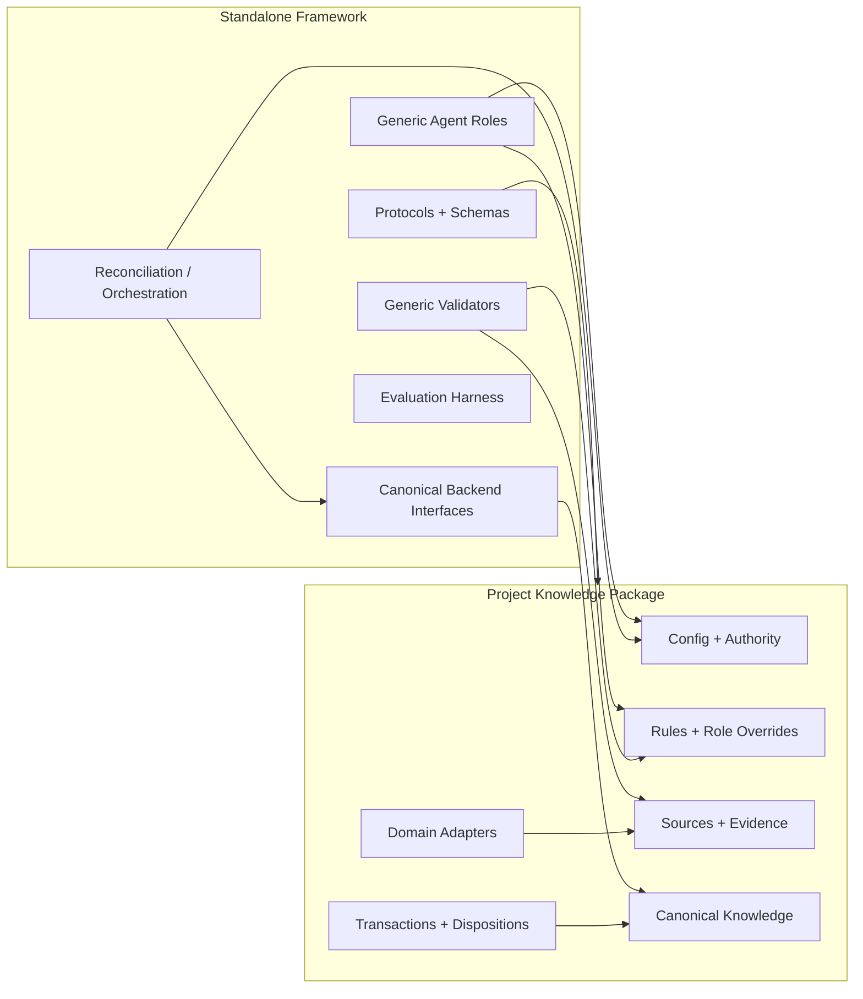
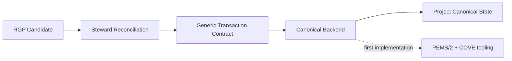

# Engineer Review and Architecture Synthesis — Extraction v2

Status: **Recommend approve with refinements**
Date: 2026-08-17
Role invocation: **Engineer — independent reviewer/synthesizer**
Input: `EXTRACTION_V2_RPG_ENGINEER_PROPOSAL.md`

## Review result

The framework/project-instance split is implementable and materially cleaner than the previous extraction proposal. It establishes the correct dependency direction: reusable mechanisms consume project-owned knowledge/configuration; they do not own it.

Three refinements should be incorporated into the final plan.

| Refinement | Reason |
|---|---|
| Separate **protocol contracts** from **backend implementations** | A generic PEMS/COVE schema may be portable while a concrete canonical-store installer can remain an optional backend. Avoid making one storage representation inseparable from RGP. |
| Define a small **Project Knowledge Package contract** before moving files | Generic validators/agents need a stable way to locate rules, sources, authority configuration, canonical backend, and adapters without assuming voxel-engine paths. |
| Treat generic roles as **role contracts + default directives**, not project authorities | `Steward` can define responsibilities generically, but authority is granted by the consuming project configuration. |

## Synthesized architecture



### Dependency rule

Framework code may depend on framework contracts and on data supplied through the Project Knowledge Package contract. Project packages may depend on a versioned framework release. **Framework code must not import a consuming project's implementation.**

## Project Knowledge Package contract — minimum viable shape

The extraction should define only enough contract to remove path assumptions:

```text
project-knowledge/
├── project.yaml          # package identity + framework compatibility
├── authority/            # role assignments / authority-bearing config
├── rules/                # project rules consumed by agents/validators
├── roles/                # project role directives/overrides
├── sources/              # source registry
├── evidence/             # project evidence envelopes/artifacts
├── canonical/            # active project knowledge backend data
├── transactions/         # Steward-authored reconciliation artifacts
├── dispositions/         # final project decisions
└── adapters/             # project evidence/integration adapters
```

The contract should specify required capabilities and paths, not domain vocabulary.

## Backend boundary



PEMS/2+COVE can be the first supported backend and its generic schemas/validators can move. The active voxel-engine PEMS/COVE files remain project-owned. This keeps proven machinery while avoiding an unnecessary claim that all future projects must use that canonical representation.

## Extraction sequence

| Step | Action | Gate |
|---:|---|---|
| 1 | Freeze source commit and blob manifest | No extraction without immutable baseline |
| 2 | Classify artifacts: framework / reference corpus / project-owned | Every copied artifact classified |
| 3 | Create standalone skeleton | No behavior changes |
| 4 | Copy generic protocols, schemas, validators, role contracts, orchestration, tests | Byte-preserve fixtures where required |
| 5 | Copy voxel-engine reference corpus | Reference-only; no active canonical ownership transfer |
| 6 | Introduce minimal Project Knowledge Package path/config abstraction | Only remove project-path coupling |
| 7 | Run parity suite | Same relevant outcomes as frozen baseline |
| 8 | Tag/record extraction-parity baseline | Blocks redesign until PASS |
| 9 | Migrate voxel-engine consumer to versioned framework | Remove duplicate generic implementation after successful integration |
| 10 | Resume Phase 6.1+ productization | Standalone repository becomes development home |

## Parity matrix

| Capability | Required parity evidence |
|---|---|
| RGP validation | Same fixture pass/fail outcomes |
| Distiller evaluation | Frozen corpus retains expected scoring/constraints |
| Authority boundary | Distiller cannot reconcile/admit; Steward remains authority |
| Admission proof | Same deterministic transaction behavior on fixed fixtures |
| Exact-base safety | Stale/mismatched bases fail closed |
| Exact-byte install | Backend installs proved bytes only |
| Project isolation | Framework tests do not read active voxel-engine canonical paths |

## Risks requiring explicit tests

1. **Hidden path coupling** — scan/tests must catch references to voxel-engine-specific repository paths in framework code.
2. **Policy leakage** — generic defaults must not silently encode voxel-engine rules.
3. **Authority confusion** — a default Steward directive must not itself grant authority.
4. **Backend overcoupling** — RGP/Distiller tests must run without loading PEMS/COVE backend code unless admission/backend behavior is under test.
5. **Corpus mutation** — extracted historical candidates and fixed evidence must be digest-checked.

## Recommendation

Approve the v2 direction with the three refinements above. The first implementation deliverable should be an extraction manifest plus minimal Project Knowledge Package contract, followed by parity—not a redesigned Distiller interface.
