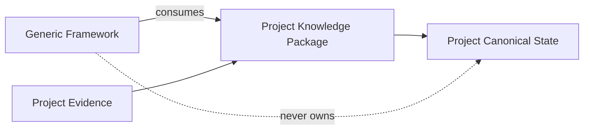
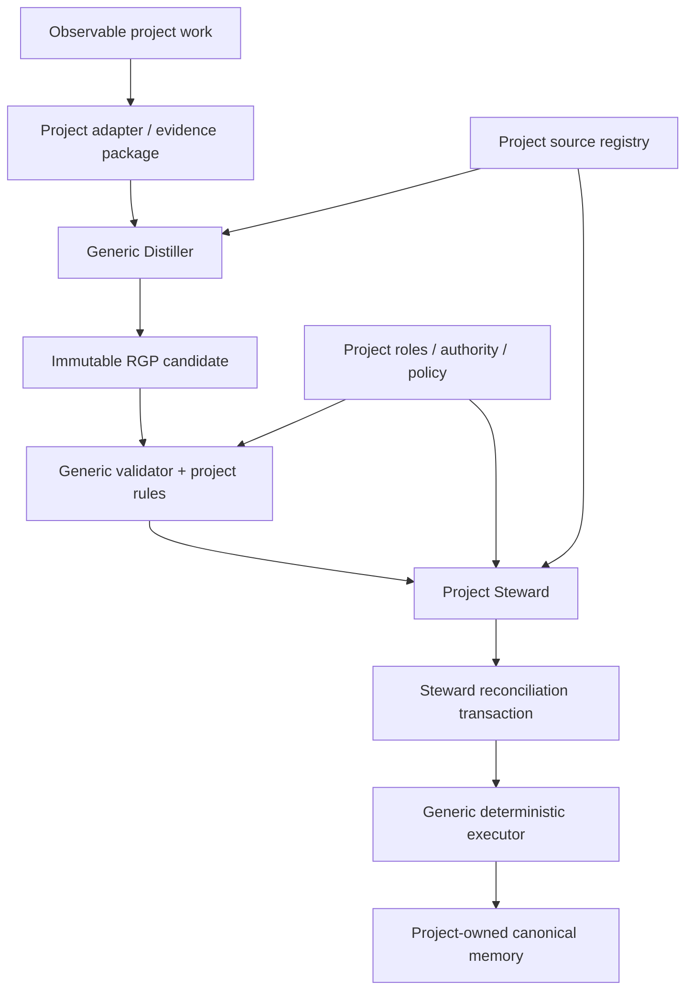

# RPG Engineer Proposal — Standalone Knowledge-System Framework Extraction v2

Status: **Proposed**
Date: 2026-08-17
Supersedes for review: `docs/distiller/PROPOSAL_STANDALONE_REPOSITORY.md`
Role invocation: **RPG Engineer — proposal author**

## Decision requested

Extract the reusable knowledge-system framework into a standalone repository while keeping each consuming project's knowledge instance, policy, authority configuration, and canonical data project-owned.

The voxel-engine work remains the fixed reference corpus used to prove extraction parity and future regressions.

## Design principle

> The framework defines how project knowledge is represented, produced, validated, reconciled, governed, and executed. A project knowledge package defines the actual knowledge, evidence, policy, authority, and configuration for one project.

This is a dependency boundary, not merely a directory cleanup.



## Proposed ownership split

| Concern | Standalone framework | Project knowledge package |
|---|---:|---:|
| RGP protocol/schema | ✓ | |
| Generic evidence-envelope contracts | ✓ | |
| Generic PEMS/COVE contracts and format tooling | ✓ | |
| Generic validators | ✓ | |
| Generic Distiller role/directive | ✓ | |
| Generic Steward role/authority contract | ✓ | |
| Generic Architect/engineering roles | ✓ | |
| Generic reconciliation/admission transaction contracts | ✓ | |
| Deterministic proof/execution engine | ✓ | |
| Evaluation harness and generic fixtures | ✓ | |
| Actual project PEMS/COVE data | | ✓ |
| Project source/evidence registry | | ✓ |
| Project rulesets consumed by agents/validators | | ✓ |
| Project role configuration/directives | | ✓ |
| Project authority assignments | | ✓ |
| Project admission policy | | ✓ |
| Project transactions/dispositions | | ✓ |
| Domain adapters/extensions | | ✓ |

A generic schema or validator may live in the framework even when it operates on project-owned data. A project's active data and rules do not become framework-owned merely because generic tooling consumes them.

## Target repository model

```text
reasoning-distiller/
├── protocols/
│   ├── rgp/
│   ├── evidence/
│   ├── reconciliation/
│   └── lifecycle/
├── schemas/
├── validators/
├── agents/
│   ├── distiller/
│   ├── steward/
│   ├── architect/
│   └── engineer/
├── reconciliation/
├── admission/
├── orchestration/
├── evaluation/
│   ├── harness/
│   ├── fixtures/
│   └── corpus/
│       └── voxel-engine/
├── tests/
└── docs/
```

A consuming repository uses a project-owned package such as:

```text
project-knowledge/
├── canonical/
│   ├── pems/
│   └── cove/
├── sources/
├── evidence/
├── rules/
├── roles/
├── authority/
├── policy/
├── transactions/
├── dispositions/
├── adapters/
└── config/
```

The exact directory name is project-configurable; the ownership boundary is normative.

## Runtime relationship



The Distiller remains candidate-only. The Steward remains the semantic reconciliation/admission authority. Generic execution applies an already-authorized transaction; it does not acquire semantic authority.

## Voxel-engine proving corpus

The standalone repository should contain a **reference copy** of the fixed voxel-engine evaluation corpus and parity evidence, with extraction provenance. This corpus is test material, not active voxel-engine canonical state.

Preserve:

- fixed Phase 0 inputs and expected outcomes;
- raw independent Phase 1 candidates;
- validator fixtures and Phase 2 evidence;
- representative Phase 3 shadow cases;
- selected Phase 4/5 transaction/proof fixtures sufficient to test authority and deterministic execution;
- source repository, branch, commit, source path, and blob digest for every extracted artifact.

Do not migrate active voxel-engine PEMS/COVE as standalone canonical memory.

## Extraction rules

1. Freeze an exact source commit before extraction.
2. Produce a machine-readable extraction manifest.
3. Classify every moved/copied artifact as `framework`, `reference-corpus`, or `project-owned`.
4. Copy before refactoring.
5. Establish behavioral parity before interface redesign.
6. Keep `rgp/1` semantics frozen during parity work.
7. Preserve immutable historical outputs byte-for-byte where they are regression fixtures.
8. Do not compile voxel-engine policy into generic agents or validators.
9. Generic components may expose extension/configuration points only where current evidence demonstrates a need.
10. A second project is required before declaring untested cross-domain abstractions stable.

## Phase 6 revision

| Gate | Outcome |
|---|---|
| 6.0A | Freeze extraction baseline and manifest |
| 6.0B | Create standalone skeleton and ownership boundaries |
| 6.0C | Copy generic framework and voxel reference corpus |
| 6.0D | Establish behavioral parity |
| 6.0E | Establish first standalone baseline/release |
| 6.1+ | Resume production interface/productization work only after parity |

## Acceptance criteria

Extraction is successful when:

- generic framework tests pass independently of active voxel-engine canonical files;
- voxel-engine reference corpus produces the same relevant validation/evaluation outcomes as the frozen source baseline;
- no project-owned canonical state is treated as framework state;
- project rules and authority configuration are inputs to generic components, not hard-coded dependencies;
- Distiller has no reconciliation/admission authority;
- Steward authority remains project-scoped;
- deterministic execution remains exact-base and auditable;
- the voxel engine can later consume a versioned standalone release without duplicating generic implementation.

## Deferred

Do not use extraction to introduce a database, service topology, plugin ecosystem, new reasoning ontology, automated semantic reconciliation, or RGP vocabulary expansion. Those require separate evidence and decisions.

## Recommendation

Proceed with extraction under this framework/project-instance split, subject to independent engineering synthesis and Steward approval. Do not begin Phase 6.1 contract redesign until extraction parity is recorded.
